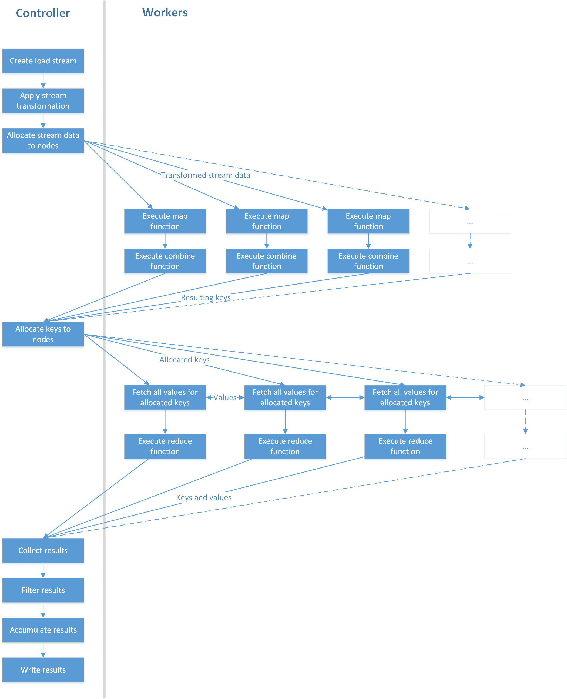
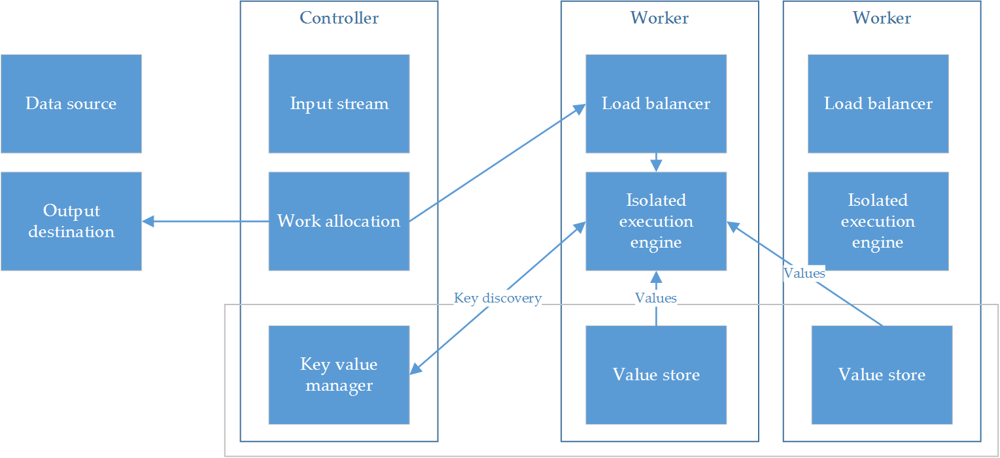

# JSMR

_JavaScript MapReduce_

JSMR is a JavaScript system for processing big data on distributed systems. It automatically parallelizes MapReduce problems, with load balancing across all nodes in the system, and uses purely in-memory storage for low latency. It also contains a distributed key-value store for spreading the storage load across all nodes in the system. It offers a near linear performance improvement as hardware is added. It is a rapidly installable system for one-off distributed processing tasks on standard desktop hardware. It requires little to no configuration, is applicable to a wide range of problems within the MapReduce paradigm, and scales effectively.

* **Declarative:** JSMR handles the details of how data is communicated and balanced between nodes. You only need to write the application code and set the controller IP address.
* **Scalable:** Each worker contains its own load balancer, to request the correct amount of data for its own processing capability. More powerful machines will scale up faster to process data faster as the application runs.
* **Simple:** In comparison to other solutions, JSMR only needs Node installed. The entire stack from communication to data storage is written in JavaScript.

## Installation

- Clone this repository onto each machine
- Run `npm install`
- Create a `.env` file with the following properties:
	- For a worker: `CONTROLLER_IP=1.2.3.4` where `1.2.3.4` is the IP address of the controller to connect to.
	- For a controller: `APP=wordcount` where `wordcount` is the name of the application to run.
- Run `node controller.js` or `node worker.js` depending on the role the machine should take.

## Examples

This example runs a simple wordcount. This code is bundled with the application; to run it, set the `APP` environment variable to `wordcount`.

```js
module.exports = {

	// Read the input as a stream.
	load: () => require('rs').createReadStream('file.txt', {
		encoding: 'UTF-8'
	}),

	// Transform each stream chunk into a collection of words on arrival.
	transform: content => content
		.split(/\n| /)
		.map(word => word.trim().replace(/\W/g, '').toLowerCase())
		.filter(word => word !== ''),

	// Count one for each word encountered.
	map: word => ({ key: word, value: 1 }),

	// Count up words with the same key as soon as possible while mapping continues.
	combine: collection => collection.reduce((sum, word) => sum + word.value, 0),

	// Count up all words with the same key once all mapping has finished.
	reduce: collection => collection.reduce((sum, word) => sum + word.value, 0),

	// Sort words by occurence.
	aggregate: collection => collection.sort((a, b) => b.value - a.value),

	// Write the output to a file.
	write: result => new Promise(resolve => {
		fs.writeFile('./output/wordcount.json', JSON.stringify(result, null, '\t'), 'utf8', resolve);
	})
};
```

## Usage

The exported object may contain the following properties:

### `load()`

A readable stream from which data is read into a buffer to avoid overflowing memory constraints on the controller.

### `transform(chunk)`

Applied to each chunk of data from the load stream, and used to convert the input data to a format suitable for mapping.

### `map(item)`

Should return an object with "key" and "value" properties. The key is used to sort each collection of values such that the same machine will process them all.

### `combine(collection[])`

A reduce function that is executed on a worker to the items it already has. Often the same as the reduce function.

### `reduce(collection[])`

Takes an array of key/value pairs and returns a single value to represent the reduction of those inputs

### `filter(kvpair)`

Takes a single key/value pair result from a reduce operation, and returns a Boolean representing whether this item should be kept.

### `aggregate(outputs[])`

Takes the collection of key/value pairs from reduction, and transforms them to a meaningful result in the context of the application.

### `write(outputs[])`

Takes the aggregated result, and should return a promise that resolves when the result has been handled

### `debug`

- `debug.print`: A Boolean describing whether the worker nodes should print a log of their processing status and intercommunications. Outputting text to the console can be a slow operation in Node.

- `debug.slow`: A number in milliseconds, which controls the time delay between each operation. This can be useful for developing algorithms to view each step taken in realtime.

## Behind the scenes

### Overview



### Map phase


### Reduce phase



## Next steps

- Browser-based client access to add resources by visiting a URL
- Simultaneous job support
- Data replication for fault tolerance
- Docker support
